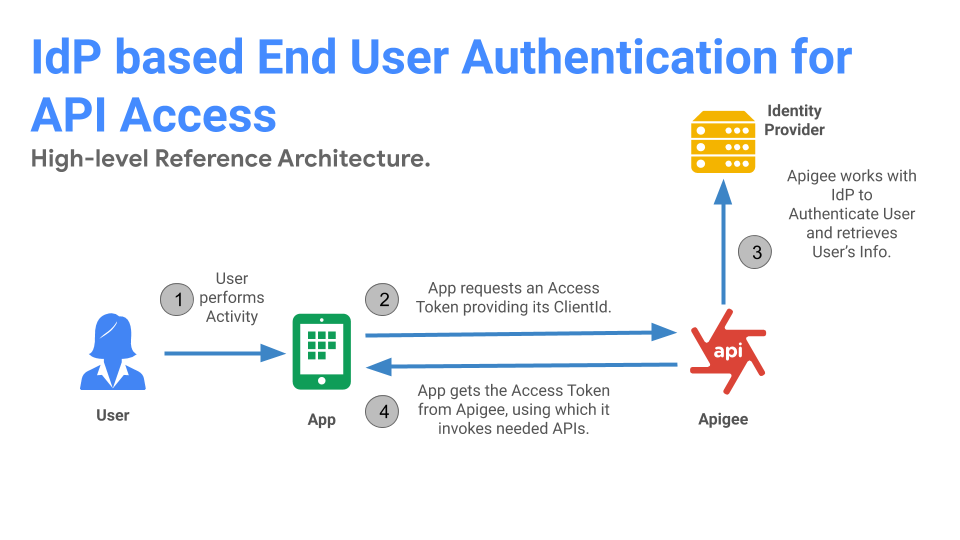

# Apigee IdP Pattern 1A - End-user Authentication for API access.

This is a commonly used enterprise pattern where the access to APIs requires end-user Authentication. The pattern is based on the below decisions from the [IdP Integration Decision Graph](https://github.com/nas-hub/Apigee-Enterprise-Security-Design-Patterns/tree/master/IAM-Integration#decision-graph):

**Decision 1**:  Access to APIs requires end-user authentication.

**Decision 2:** Enterprise IdP can authenticate all end-user types.

**Decision 3:** Apigee authenticates Application.

**Decision 4:** Apigee will be the end-user Access Token Authority.

## Reference Architecture:

### Key tenets:
1. End-users are always authenticated against centralized Identity Provider (IdP).
2. API Products and Applications are always managed by API Platform - Apigee. Application are authenticated by Apigee.
3. Apigee manages end-user tokens relying the IdP authentication/assertion tokens.
4. There is clear separation of concerns between enterprise API Platform and Enterprise Identity and Access Management Systems.

## Architecture Modules:

**Module 1** :  Identity Provider

**Module 2** : User Agent

**Module 3**:  Apigee

**Reference architecture flow**:

**Step 1**: User initiates an activity. (Ex: User launches the App)

**Step 2**: App found no prior Access Token and thus initiates a Token request against Apigee.

**Step 3**: Apigee identifies the App with Client Id and initiates configured IdP based end-user authentication handshake.

**Step 4**: Post successful IdP handshake, Apigee issues an Access Token.

## Deployable Solutions

### List of deployable solutions based on above reference architecture:

**[End-user Authentication for API access via OpenId Connect](https://github.com/nas-hub/enduser-authentication-for-api-access-via-oidc)** 

**End-user Authentication for API access via SAML (coming soon..)** 

**End-user Authentication for API access via OAuth 2.0 (coming soon..)** 

