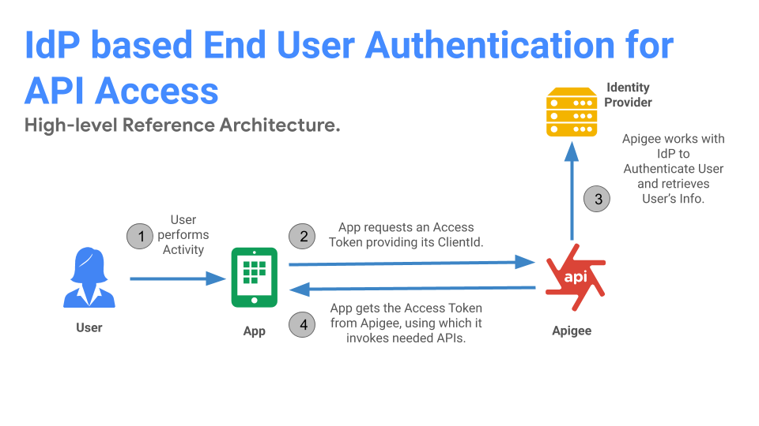

# Apigee as standards based authentication interface for an existing Enterprise Identity Store.

This is a common enterprise pattern where the access to APIs requires end-user Authentication and enterprise only has Authentication Service. The pattern is based on the below decisions from the [IdP Integration Decision Graph](https://github.com/nas-hub/Apigee-Enterprise-Security-Design-Patterns/tree/master/IAM-Integration#decision-graph):

**Decision 1**: Access to APIs requires end-user authentication.

**Decision 2:** No Identity Provider modules exists, Identity Store authenticates End User. Apigee provides standards based authentication services on top of existing Identity Store.

## Reference Architecture:

### Key tenets:
1. Mobile, Web and B2B applications can leverage standards based authentication services. 
2. End-users are always authenticated against enterprise Identity Store via Apigee published interfaces.
3. API Products and Applications are always managed by Apigee. Application are authenticated by Apigee.
4. Apigee manages end-user tokens.

## Architecture Modules:

**Module 1** :  Identity Store

**Module 2** : User Agent

**Module 3**:  Apigee

**Reference architecture flow**:

**Step 1**: User initiates an activity. (Ex: User launches the App)

**Step 2**: App found no prior Access Token and thus initiates standards based End-User authentication against Apigee.

**Step 3**: Apigee identifies the App with Client Id and initiates configured end-user authentication protocol.

**Step 4**: Post successful Authentication of credentials from Identity Store, Apigee issues an Access Token.

## Deployable Solutions

### List of deployable solutions based on above reference architecture:

**[Apigee as OIDC Identity Provider for an existing Authentication Service](https://github.com/nas-hub/apigee-as-oidc-idp-for-existing-authentication-service)** 

**[Apigee as OIDC Interface for GCIP](https://github.com/nas-hub/apigee-as-oidc-interface-for-cicp)**
 

