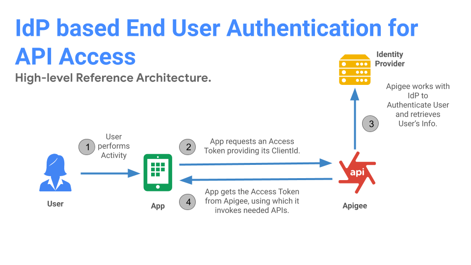

# Apigee and Enterprise Identity Store Pattern - End-user Authentication for API access.

This is a commonly used enterprise pattern where the access to APIs requires end-user Authentication. The pattern is based on the below decisions from the [IdP Integration Decision Graph](https://github.com/nas-hub/Apigee-Enterprise-Security-Design-Patterns/tree/master/IAM-Integration#decision-graph):

**Decision 1**: Access to APIs requires end-user authentication.

**Decision 2:** Apigee provides standards based authentication services on top of Identity Store.

**Decision 3:** Apigee authenticates Application.

**Decision 4:** Apigee will be the end-user Access Token Authority.

## Reference Architecture:

### Key tenets:
1. Mobile, Web and B2B applications can leverage standards based authentication services. 
2. End-users are always authenticated against enterprise Identity Store via Apigee published interfaces.
3. API Products and Applications are always managed by Apigee. Application are authenticated by Apigee.
4. Apigee manages end-user tokens.

## Architecture Modules:

**Module 1** :  Identity Store

**Module 2** : User Agent

**Module 3**:  Apigee

**Reference architecture flow**:

**Step 1**: User initiates an activity. (Ex: User launches the App)

**Step 2**: App found no prior Access Token and thus initiates standards based End-User authentication against Apigee.

**Step 3**: Apigee identifies the App with Client Id and initiates configured end-user authentication protocol.

**Step 4**: Post successful Authentication of credentials from Identity Store, Apigee issues an Access Token.

## Deployable Solutions

### List of deployable solutions based on above reference architecture:

**[End-user Authentication for API access over OpenId Connect](https://github.com/nas-hub/enduser-authentication-for-api-access-via-oidc)** 

**[End-user Authentication for API access over OAuth](coming soon..)** 
 

