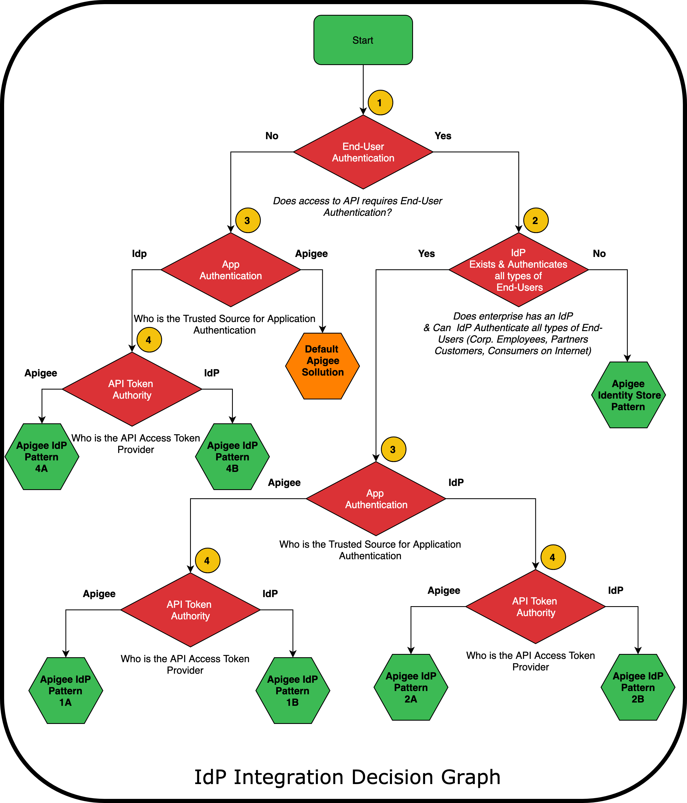

# Apigee and Identity & Access Management (I&AM) integration

## Overview
Apigee API Platform provides various options to work with enterprise I&AM systems.
APIs published on Apigee can leverage I&AM services to implement enterprise defined processes for authentication, authorization and SSO.

## Integration Patterns
Based on requirements across enterprise customers, here is a list of 7 most commonly used Apigee and I&AM integration design patterns.

Below decision graph helps you pick the right design pattern that addresses your enterprise needs.
The leaf nodes of this graph are the 7 design patterns, based on your key decisions you make at each decision node you land upon a specific design pattern that best fits your needs. 

The design pattern refers to a high level reference architecture, a well-defined solution architecture and fully deployable Apigee solution.

## Glossary / Terminology
**IdP** :Identity Provider, the solution that is responsible for providing Identity services such as Authentication, Authorization and SSO.

**end-user**: end-user refers to the actor that accesses the APIs at runtime from his/her mobile device, web applications etc.

**App**: App refers to the Application from which the APIs are invoked at runtime.

**API Token Authority**: Refers to the component that provides API Access Tokens. These API Access Token can be used for Identification, Authentication and in some cases Authorization.

## Decision Graph
Here is the graph that helps you pick the design pattern that fulfills your enterprise security requirements.

Here are detailed of key decision you make in the above decision graph:

**Decision 1:**  end-user Authentication: This is the first key decision, the question here really is about the need for the API to know who the actual end-user is. If the API is protected and can only be accessed by authenticated users then the answer should be Yes. If the API does not need to know the end-users the answer should be No; note that the API might still need to Identify/Authenticate the calling Application.

**Decision 2:** IdP can authenticate all types of users: This is a very critical key decision, where-in we need to know different types of end-users that may access this API and also can all these different types of end-users be authenticated using the IdP.  If the answer is No, then that leads to a solution that requires Apigee to play the role of Identity Authentication Broker. 

**Decision 3:** App Authentication: Which component is the trusted source to identify/authenticate Applications. This decision will also be based on which App Store front and DevPortal is being used to register Applications.

**Decision 4:** API Token Authority: Which component issues API Access Tokens that will be used for granting/revoking access to APIs.

## Solutions Architecture

Each green hexagon represents a design pattern that is derived based on above decisions. Below links to these design patterns show its reference and solution architecture.

[Apigee IdP Pattern 1A](./IdP-Pattern-1A)

Apigee IdP Pattern 1B (coming soon..)

Apigee IdP Pattern 2A (coming soon..)

Apigee IdP Pattern 2B (coming soon..)

Apigee IdP Pattern 3 (coming soon..)

Apigee IdP Pattern 4A (coming soon..)

Apigee IdP Pattern 4B (coming soon..)
